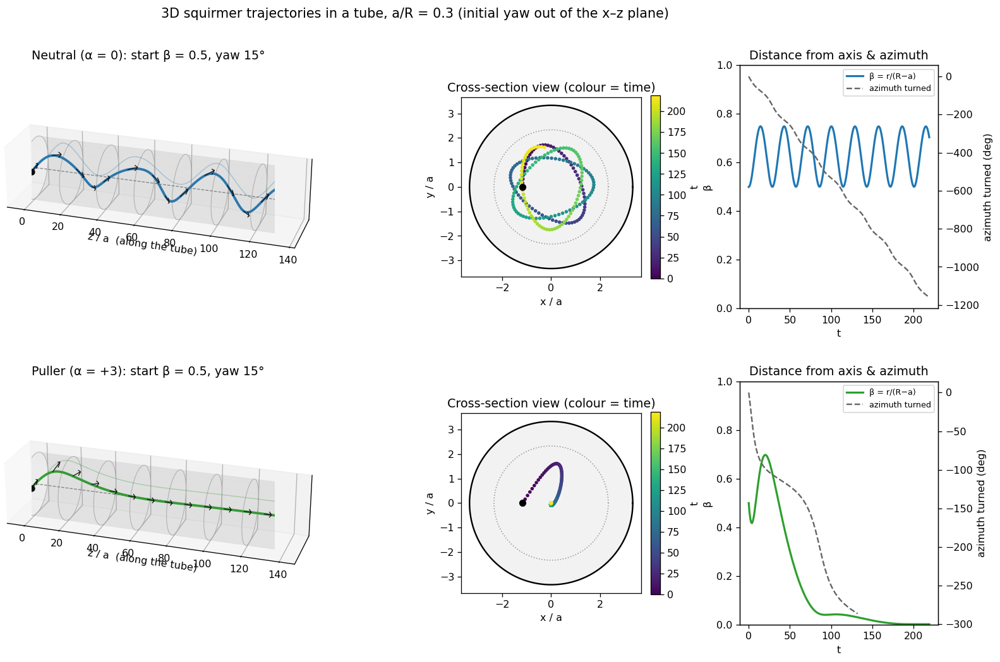

# squirmer-BEM-3dtube

# squirmer-bem

**Boundary element simulations of a spherical squirmer (model microswimmer) inside a cylindrical tube.**

A 3D boundary element method (BEM) for Stokes flow, written in C++17 with OpenBLAS. The code is built up and validated in three stages:

1. **Duct flow.** Pressure-driven flow in an empty tube, recovering Hagen–Poiseuille flow from a pressure drop alone.
2. **Squirmer flow and kinematics.** Swimming velocity, rotation and flow field of a squirmer in unbounded fluid and inside the tube.
3. **Trajectories.** Time-integrated swimmer paths: wavy, crashing, centring and wall-following swimmers.

Every stage is checked against exact solutions or published results (Blake 1971; Haberman & Sayre 1958; Zhu, Lauga & Brandt 2013). A step-by-step tutorial is in [`notebooks/tutorial.ipynb`](notebooks/tutorial.ipynb).


<p align="center">
  <br>
  <em>.</em>
</p>

| Stage 1: duct flow | Stage 2: squirmer in a tube |
|---|---|
|  |  |




---

## Contents

1. [Quick start](#1-quick-start)
2. [Repository structure](#2-repository-structure)
3. [Input files](#3-input-files)
4. [Output files](#4-output-files)
5. [Tests](#5-tests)
6. [Theory](#6-theory)
7. [Numerical method](#7-numerical-method)
8. [Validation results](#8-validation-results)
9. [Performance](#9-performance)
10. [Limitations and possible extensions](#10-limitations-and-possible-extensions)
11. [References](#11-references)

---

## 1. Quick start

**Requirements**

* A C++17 compiler (g++ ≥ 9 or clang ≥ 10)
* BLAS and LAPACK. [OpenBLAS](https://www.openblas.net/) is strongly recommended, since it provides both and is fast. On Ubuntu: `sudo apt install libopenblas-dev`. On macOS: `brew install openblas`.
* For plots and the tutorial: Python 3 with `numpy`, `matplotlib`, `jupyter` (`pip install -r requirements.txt`)

**Build** (either way works)

```bash
# CMake
cmake -S . -B build -DCMAKE_BUILD_TYPE=Release
cmake --build build

# or plain make
make
```

On macOS with Homebrew OpenBLAS you may need
`cmake -S . -B build -DCMAKE_PREFIX_PATH=$(brew --prefix openblas)`, or
`make LIBS="-L$(brew --prefix openblas)/lib -lopenblas"`.

**Run**

```bash
./build/squirmer_bem inputs/duct_flow.in             # Stage 1          (~2 s)
./build/squirmer_bem inputs/squirmer_kinematics.in   # Stage 2          (~1.5 min)
./build/squirmer_bem inputs/squirmer_field.in        # Stage 2          (~10 s)
./build/squirmer_bem inputs/trajectory_neutral.in    # Stage 3          (~10 min)
```

Any input value can be overridden on the command line:

```bash
./build/squirmer_bem inputs/squirmer_kinematics.in a_over_R="0.2 0.4" beta=0 sphere_level=2
```

**Test**

```bash
cd build && ctest --output-on-failure     # or: make test   (~2 min)
```

**Tutorial**

```bash
jupyter notebook notebooks/tutorial.ipynb
```

---

## 2. Repository structure

```
squirmer-bem/
├── README.md                 this file
├── CMakeLists.txt            CMake build (main program + tests)
├── Makefile                  plain-make alternative
├── requirements.txt          Python packages for plots and tutorial
├── LICENSE
│
├── src/                      main source code (header-only library + driver)
│   ├── main.cpp              command-line program: reads an input file, runs a mode
│   ├── duct_flow.hpp         Stage 1 solver: pressure-driven flow, mixed boundary conditions
│   ├── swimmer.hpp           Stage 2 solver: squirmer in a closed tube or unbounded fluid
│   ├── trajectory.hpp        Stage 3: time integration (AB4) with checkpoint/restart
│   └── utils/
│       ├── vec3.hpp          3-vector type, constants
│       ├── linalg.hpp        dense matrix, BLAS/LAPACK wrappers (dgemm, dgetrf, dgetrs, dgesv)
│       ├── quadrature.hpp    triangle quadrature rules, Gauss–Legendre
│       ├── mesh.hpp          surface meshes: tube (uniform or graded), icosphere
│       ├── kernels.hpp       Stokeslet/stresslet panel integrals, singular quadrature, squirmer slip
│       ├── field.hpp         velocity at points inside the fluid
│       ├── config.hpp        "key = value" input-file reader
│       └── io.hpp            CSV writer, timers
│
├── inputs/                   example input files (documented inline)
│   ├── duct_flow.in
│   ├── squirmer_kinematics.in
│   ├── squirmer_field.in
│   ├── trajectory_{neutral,pusher,puller_a3,puller_a5}.in
│   └── trajectory_{neutral,puller_a3}_3d.in
│
├── outputs/                  results are written here (git-ignored)
│   └── reference/            pre-computed reference results (tracked)
│       ├── squirmer/         data of the Stage 2 figure (test_squirmer --full)
│       ├── trajectories/     the four production trajectories
│       └── traj3d/           the two 3D (helical / centring) trajectories
│
├── tests/
│   ├── test_common.hpp       PASS/FAIL helper
│   ├── test_duct_flow.cpp    Stage 1 checks
│   ├── test_squirmer.cpp     Stage 2 checks   (--full for production meshes)
│   ├── test_trajectory.cpp   Stage 3 checks   (optional; --full for the long runs)
│   ├── plot_duct_flow.py     figures from the test data
│   ├── plot_squirmer.py
│   ├── plot_trajectories.py
│   └── plot_trajectories_3d.py
│
├── notebooks/
│   └── tutorial.ipynb        step-by-step tutorial (executed, with outputs)
│
└── docs/images/              figures used in this README
```

All physics lives in header files, so a test or a new program only needs `#include "swimmer.hpp"` (with `-Isrc`) and must link BLAS/LAPACK.

---

## 3. Input files

Input files contain `key = value` lines, with `#` comments. Lists are separated by spaces or commas. Command-line arguments `key=value` override the file. Every file has a `mode` and an `output_dir` (default `outputs/<mode>`).

**Units:** squirmer radius $a = 1$, viscosity $\mu = 1$, $B_1 = 1$. Lengths are in units of $a$, velocities in units of $B_1$, times in units of $a/B_1$. The free-space squirmer speed is $U_0 = 2/3$. (Stage 1 uses its own tube radius `R`.)

### `mode = duct` (Stage 1)

| key | default | meaning |
|---|---|---|
| `R`, `L`, `mu` | 1, 4, 1 | tube radius, length, viscosity |
| `n_theta`, `n_z`, `n_r` | 24, 24, 6 | panels around the circumference, along the axis, rings on each cap |
| `dP_list` | `0.5 1 2 4` | pressure drops to solve (one factorisation, many right-hand sides) |
| `p_out` | 0 | outlet pressure |
| `dP_detail` | 1 | pressure drop used for `panels.csv` and `profile.csv` |
| `n_profile` | 20 | interior points per radial line at $z = L/2$ |

### `mode = kinematics` (Stage 2)

| key | default | meaning |
|---|---|---|
| `a_over_R` | 0.3 | confinement $a/R$; a list is allowed. `0` means unbounded fluid |
| `beta` | 0 | offset from the axis, $\beta = b/(R-a)$; a list is allowed |
| `n_theta` | 24 | tube panels around (use 36 for $\beta > 0.7$) |
| `sphere_level` | 3 | icosphere refinement: $20\cdot 4^{\ell}$ panels (2 → 320, 3 → 1280) |
| `L_over_R` | 4 | tube length (closed ends) |
| `towed_drag` | 1 | also compute the drag of a towed rigid sphere (on-axis cases only) |

### `mode = field` (Stage 2)

| key | default | meaning |
|---|---|---|
| `a_over_R`, `beta`, `n_theta`, `sphere_level`, `L_over_R` | as above | |
| `nx`, `nz` | 25, 57 | grid points across and along the tube (plane $y = 0$) |
| `z_extent` | 7 | grid covers $|z| \le$ `z_extent` |
| `x_extent` | 4 | grid half-width, unbounded case only |

### `mode = trajectory` (Stage 3)

| key | default | meaning |
|---|---|---|
| `name` | `trajectory` | output file prefix |
| `alpha` | 0 | $\alpha = B_2/B_1$: pusher < 0 < puller |
| `a_over_R` | 0.3 | confinement |
| `beta0` | 0.5 | initial offset from the axis |
| `pitch0_deg`, `yaw0_deg` | 0, 0 | initial tilt toward the radial (+x) and azimuthal (+y) directions |
| `dt`, `t_max` | 0.5, 100 | time step and final time |
| `n_theta`, `sphere_level`, `L_over_R` | 30, 2, 4 | resolution |
| `beta_stop` | 0.95 | stop when this close to the wall |
| `budget_s` | 0 | wall-clock limit per call; rerun the same command to resume (0 = no limit) |

---

## 4. Output files

All outputs are CSV files: optional `# ...` comment lines, then one header line.

| mode | file | columns |
|---|---|---|
| duct | `flow_rate.csv` | `dP, Q, Q_exact, rel_err` |
| | `profile.csv` | `x, y, z, r, ux, uy, uz, uz_exact` (interior points at $z = L/2$) |
| | `panels.csv` | `cx, cy, cz, nx, ny, nz, area, tag, ux, uy, uz, fx, fy, fz` (one row per panel) |
| kinematics | `kinematics.csv` | `a_over_R, beta, panels, UB1x..z, OB1x..z, UB2x..z, OB2x..z, drag_K, seconds` |
| field | `field_B1.csv`, `field_B2.csv` | `x, z, ux, uy, uz` (lab frame; `NaN` inside the sphere) |
| | `field_info.csv` | `a_over_R, beta, R, UB1z, UB2z, OB1y` |
| trajectory | `<name>.csv` | `t, x, y, z, ex, ey, ez, Ux, Uy, Uz, Omx, Omy, Omz, beta` |
| | `<name>.ckpt` | restart file (deleted when the run finishes) |

**Superposition.** `kinematics` and `field` always report the two squirming modes separately: $B_1 = 1$ ("B1") and $B_2 = 1$ ("B2"). By linearity of Stokes flow, a squirmer with $\alpha = B_2/B_1$ has

$$\mathbf U = \mathbf U_{B_1} + \alpha\,\mathbf U_{B_2}, \qquad \boldsymbol\Omega = \boldsymbol\Omega_{B_1} + \alpha\,\boldsymbol\Omega_{B_2}, \qquad \mathbf u(\mathbf x) = \mathbf u_{B_1}(\mathbf x) + \alpha\,\mathbf u_{B_2}(\mathbf x).$$

Tube panel tags are `0` wall, `1` inlet cap, `2` outlet cap, `10` sphere. Normals always point **out of the fluid**, and `f` is the traction $\boldsymbol\sigma\cdot\mathbf m$ with that normal.

---

## 5. Tests

| test | quick run | checks |
|---|---|---|
| `test_duct_flow` | ~5 s | $Q$ vs Hagen–Poiseuille (< 1 %); exact linearity in $\Delta P$; interior profile (< 2 %); wall pressure and shear; monotone mesh convergence |
| `test_squirmer` | ~20 s (`--full`: ~2.5 min) | free-space drag $6\pi\mu a U$, speed $2B_1/3$, Blake's flow field; towed-sphere drag vs Haberman–Sayre for $a/R \le 0.4$ (< 1 %); speed decreasing with confinement; $B_2$ mode inactive on the axis; Lorentz reciprocal theorem (< 1 %); off-axis rotation away from the wall, puller drift away from the wall, and the mode symmetries (exact zeros); decay of the flow along the tube |
| `test_trajectory` (optional) | ~1.5 min (`--full`: ~30 min) | neutral squirmer turns at its starting distance (amplitude $2b_I$, < 1 %); pusher reaches the wall |

Each test prints `[PASS]`/`[FAIL]` lines, returns a non-zero exit code on failure, and writes its data to `outputs/tests/<name>/`. To make the figures:

```bash
python3 tests/plot_duct_flow.py                                 # -> outputs/tests/fig_duct_flow.png
python3 tests/plot_squirmer.py                                  # -> outputs/tests/fig_squirmer.png
python3 tests/plot_trajectories.py outputs/tests/trajectories    # quick-test trajectories
python3 tests/plot_trajectories.py                              # reference trajectories
```

The README figures were produced with `test_duct_flow`, `test_squirmer --full` and the four `inputs/trajectory_*.in` runs.

---

## 6. Theory

### 6.1 Stokes flow

A microswimmer of size $a \sim 10\,\mu\text{m}$ moving at $U \sim 100\,\mu\text{m/s}$ in water has Reynolds number $Re = \rho U a/\mu \sim 10^{-3}$. Inertia is negligible, and the flow obeys the Stokes equations:

$$-\nabla p + \mu\nabla^2\mathbf u = \mathbf 0, \qquad \nabla\cdot\mathbf u = 0, \qquad \boldsymbol\sigma = -p\,\mathbf I + \mu\left(\nabla\mathbf u + \nabla\mathbf u^{T}\right).$$

These equations are linear and have no time derivative. The flow responds instantly to the current boundary motion, and solutions can be superposed.

### 6.2 Fundamental solutions

The flow due to a point force $\mathbf F$ at $\mathbf x_0$ is $u_i = G_{ij} F_j/(8\pi\mu)$, where the **Stokeslet** is

$$G_{ij}(\mathbf r) = \frac{\delta_{ij}}{r} + \frac{r_i r_j}{r^3}, \qquad \mathbf r = \mathbf x - \mathbf x_0,\quad r = |\mathbf r|.$$

The associated stress tensor defines the **stresslet**:

$$T_{ijk}(\mathbf r) = -6\,\frac{r_i r_j r_k}{r^5}.$$

### 6.3 Boundary integral representation

Let the fluid occupy a volume $V$ bounded by surfaces $S$. Take the normal $\mathbf m$ to point **out of the fluid**, and let $\mathbf f = \boldsymbol\sigma\cdot\mathbf m$ be the traction. From the Lorentz reciprocal theorem, the velocity at any point $\mathbf x_0$ inside the fluid is

$$u_j(\mathbf x_0) = \frac{1}{8\pi\mu}\int_S f_i(\mathbf x)\,G_{ij}(\mathbf x - \mathbf x_0)\,dS(\mathbf x) \;-\; \frac{1}{8\pi}\int_S u_i(\mathbf x)\,T_{ijk}(\mathbf x - \mathbf x_0)\,m_k(\mathbf x)\,dS(\mathbf x). \tag{1}$$

The first integral is the **single-layer potential**, the second the **double-layer potential**. Equation (1) is what `field.hpp` evaluates to obtain flow fields.

### 6.4 Boundary integral equation

As $\mathbf x_0$ approaches the boundary, the double layer jumps. Using the Gauss-type identity

$$\int_S T_{ijk}(\mathbf x - \mathbf x_0)\,m_k\,dS = -8\pi\,c(\mathbf x_0)\,\delta_{ij},$$

where $c = 1$ inside the fluid, $c = 1/2$ on a smooth part of $S$ and $c = 0$ outside, the jump can be subtracted out analytically. The result is the **completed** (singularity-subtracted) equation, which holds at every boundary point $\mathbf x_0$, including edges and corners:

$$0 = \frac{1}{8\pi\mu}\int_S f_i\,G_{ij}\,dS \;-\; \frac{1}{8\pi}\int_S \big[u_i(\mathbf x) - u_i(\mathbf x_0)\big]\,T_{ijk}\,m_k\,dS. \tag{2}$$

The subtraction makes the double-layer integrand weakly singular, and the solid-angle factor $c(\mathbf x_0)$ cancels exactly. The code evaluates the discrete identity numerically, so the cancellation is exact also at the discrete level. For an **unbounded** exterior fluid (a sphere with no tube), the surface at infinity contributes, and the left-hand side of (2) becomes $u_j(\mathbf x_0)$ instead of 0.

On every part of the boundary, at each point, either $\mathbf u$ or $\mathbf f$ (or a mix of components) is prescribed. Equation (2) supplies the equations for the rest.

### 6.5 Squirmer model

The squirmer (Lighthill 1952; Blake 1971; Ishikawa, Simmonds & Pedley 2006) is a rigid sphere of radius $a$ with a prescribed tangential slip velocity on its surface. Keeping the first two modes:

$$\mathbf u_s = \left(B_1\sin\theta + B_2\sin\theta\cos\theta\right)\mathbf e_\theta = \left(B_1 + B_2\cos\theta\right)\left[(\hat{\mathbf r}\cdot\mathbf e)\,\hat{\mathbf r} - \mathbf e\right],$$

with $\mathbf e$ the swimming direction and $\cos\theta = \hat{\mathbf r}\cdot\mathbf e$. The parameter $\alpha = B_2/B_1$ is the stresslet strength: pushers have $\alpha < 0$, pullers $\alpha > 0$.

The surface velocity is

$$\mathbf u(\mathbf x) = \mathbf U + \boldsymbol\Omega\times(\mathbf x - \mathbf x_c) + \mathbf u_s(\mathbf x), \qquad \mathbf x \in S_p,$$

with unknown translational and angular velocities $\mathbf U$ and $\boldsymbol\Omega$. They are fixed by the **force-free and torque-free** conditions, since there is no external force or torque:

$$\mathbf F = \int_{S_p} \boldsymbol\sigma\cdot\mathbf n\,dS = -\int_{S_p}\mathbf f\,dS = \mathbf 0, \qquad \mathbf L = -\int_{S_p}(\mathbf x - \mathbf x_c)\times\mathbf f\,dS = \mathbf 0.$$

(Here $\mathbf n = -\mathbf m$ is the normal pointing out of the particle.)

**Unbounded fluid.** The exact solution is $\mathbf U = \tfrac23 B_1\mathbf e$ and $\boldsymbol\Omega = \mathbf 0$. In spherical coordinates about the centre (lab frame; $P_2$ is the second Legendre polynomial), the flow field is

$$u_r = \frac{2}{3}B_1\frac{a^3}{r^3}\cos\theta + B_2\left(\frac{a^4}{r^4} - \frac{a^2}{r^2}\right)P_2(\cos\theta), \qquad u_\theta = \frac{1}{3}B_1\frac{a^3}{r^3}\sin\theta + B_2\frac{a^4}{r^4}\sin\theta\cos\theta.$$

### 6.6 Boundary conditions of each problem

| problem | tube wall | tube ends | sphere |
|---|---|---|---|
| Stage 1 duct flow | $\mathbf u = 0$ | $u_x = u_y = 0$, $f_z = +p_\text{in}$ (inlet, $\mathbf m = -\mathbf e_z$), $f_z = -p_\text{out}$ (outlet) | — |
| Stage 2 swimmer in tube | $\mathbf u = 0$ | closed: $\mathbf u = 0$ | $\mathbf U + \boldsymbol\Omega\times\mathbf r + \mathbf u_s$, force/torque-free |
| Towed sphere (validation) | $\mathbf u = 0$ | $\mathbf u = 0$ | $\mathbf U$ prescribed, $\mathbf u_s = 0$ |

**Duct flow.** The exact Hagen–Poiseuille solution is $u_z = G(R^2 - r^2)/4\mu$, with $G = (p_\text{in} - p_\text{out})/L$ and $Q = \pi R^4 G/8\mu$. The wall traction is $f_r = -p(z)$ and $f_z = -GR/2$.

**Closed tube.** Following Zhu, Lauga & Brandt (2013), the swimmer tube is closed at $z = \pm L/2$. This models an infinitely long tube filled with fluid at rest, with zero net flux. A force-free disturbance decays exponentially along a tube over a length of order $R$, so $L = 4R$ is enough. Increasing it to $6R$ changes the drag by 0.01 %.

**Towed sphere on the axis.** Haberman & Sayre (1958) give the drag correction $K = F/(6\pi\mu a U)$ for a tube with fluid at rest far away, as a polynomial fit:

$$K(\lambda) = \frac{1 - 0.75857\,\lambda^5}{1 - 2.1050\,\lambda + 2.0865\,\lambda^3 - 1.7068\,\lambda^5 + 0.72603\,\lambda^6}, \qquad \lambda = a/R.$$

### 6.7 Reciprocal-theorem check

For a squirmer and a towed rigid sphere in the **same** geometry (towing velocity $\hat{\mathbf U}$, traction on the body $\hat{\mathbf t}$, drag $\hat{\mathbf F}$), the Lorentz reciprocal theorem gives

$$\mathbf U\cdot\hat{\mathbf F} = -\int_{S_p}\mathbf u_s\cdot\hat{\mathbf t}\,dS .$$

This yields the swimming speed without imposing the force-free condition, which makes it an independent check of the swimmer solution (`test_squirmer`, part 3).

### 6.8 Equations of motion

$$\frac{d\mathbf X}{dt} = \mathbf U(\mathbf X,\mathbf e), \qquad \frac{d\mathbf e}{dt} = \boldsymbol\Omega(\mathbf X,\mathbf e)\times\mathbf e .$$

By the tube's symmetry, $\mathbf U$ and $\boldsymbol\Omega$ depend only on the swimmer's position in the cross-section and on its orientation, not on its axial position $z$.

---

## 7. Numerical method

### 7.1 Discretisation

Surfaces are meshed with $P$ flat triangles. Velocity and traction are taken constant on each panel. Equation (2) is enforced at every panel centroid (**collocation**), giving $3P$ equations:

$$\mathbf A_f\,\mathbf f + \mathbf A_u\,\mathbf u = \mathbf 0, \qquad
(A_f)_{3i+a,\,3p+b} = \frac{1}{8\pi\mu}\int_{p} G_{ab}(\mathbf x - \mathbf x_i)\,dS,$$

$$(A_u)_{3i+a,\,3p+b} = -\frac{1}{8\pi}\int_{p} T_{abk}\,m_k\,dS \;+\; \delta_{ip}\,\frac{1}{8\pi}\sum_{q}\int_{q} T_{abk}\,m_k\,dS .$$

The last term is the discrete version of the subtraction in (2). For each scalar unknown, the column comes from $\mathbf A_f$ (traction unknown) or from $\mathbf A_u$ (velocity unknown). The known values move to the right-hand side.

**Meshes.**

* *Tube:* $n_\theta$ panels around the circumference. For swimmer problems, the axial spacing is graded: fine within $|z| < a + R/2$, growing by a factor 1.25 toward the ends. The polygon vertices are placed at radius $R\sqrt{\gamma/\sin\gamma}$, $\gamma = 2\pi/n_\theta$, so that the faceted cross-section has the exact **area** $\pi R^2$. This removes the leading $O(h^2)$ geometric error: without it, $Q$ is off by 2.6 % with $n_\theta = 24$; with it, by 0.36 %.
* *Sphere:* a subdivided icosahedron ($20\cdot4^\ell$ panels), scaled to enclose the exact **volume** $\tfrac43\pi a^3$. This improves the drag from 0.33 % to 0.04 % error at $\ell = 3$.

### 7.2 Quadrature

| situation | rule |
|---|---|
| distance $d = |\mathbf x_c^{(p)} - \mathbf x_0|/h_p \ge 3$ | 7-point Dunavant (degree 5) |
| $1.5 \le d < 3$ / $0.75 \le d < 1.5$ / $d < 0.75$ | the same rule on 4 / 16 / 64 sub-triangles |
| $\mathbf x_0$ inside the panel (self term) | single layer: Duffy transformation on the 3 sub-triangles around $\mathbf x_0$ ($10\times10$ Gauss–Legendre), which removes the $1/r$ singularity. Double layer: exactly zero on a flat panel, since $\mathbf r\cdot\mathbf m = 0$ |

Here $h_p = \sqrt{2A_p}$ is the panel size. The same adaptive rules are used when evaluating the flow field (1). Accuracy nevertheless degrades for points closer to a surface than about one panel size (see §8).

### 7.3 Null modes and deflation

On a closed surface where the velocity is prescribed everywhere, a uniform normal traction $\mathbf f = c\,\mathbf m$ generates no flow: $\int_S G_{ij} m_i\,dS = 0$ by incompressibility. The single-layer operator is therefore singular, with one null mode per closed Dirichlet surface (the closed tube, and the sphere). These modes carry no velocity, force, torque or power ($\mathbf u_s\cdot\mathbf m = 0$), so they can be removed by **Wielandt deflation**, adding to each such block

$$\frac{1}{8\pi\mu\sqrt{A_S}}\;\mathbf m(\mathbf x_i)\,\mathbf m(\mathbf x_p)^{T}A_p ,$$

which makes the matrix invertible without changing any physical result. The duct-flow problem has none: its end caps have prescribed traction, which fixes the pressure level.

### 7.4 Rigid-body closure

The swimmer's surface velocity is written as $\mathbf u = \mathbf K\,[\mathbf U;\boldsymbol\Omega] + \mathbf u_s$, with $\mathbf K_p = [\,\mathbf I \;|\; -[\mathbf r_p]_\times\,]$. The force and torque conditions add six rows. The unknowns are all tractions plus $(\mathbf U, \boldsymbol\Omega)$.

### 7.5 Schur complement: factorise the tube once

With unknowns split into tube ($t$) and sphere ($s$), the system reads

$$\begin{pmatrix} \mathbf T & \mathbf B & \mathbf C_t \\ \mathbf D & \mathbf E & \mathbf C_s \\ \mathbf 0 & \mathbf F_c & \mathbf 0\end{pmatrix}
\begin{pmatrix}\mathbf f_t\\ \mathbf f_s\\ \mathbf U,\boldsymbol\Omega\end{pmatrix} = \begin{pmatrix}\mathbf r_t\\ \mathbf r_s\\ \mathbf 0\end{pmatrix}.$$

The tube–tube block $\mathbf T$ depends only on the tube, so it is LU-factorised **once** (class `Tube`). Each swimmer position then only requires the couplings $\mathbf B, \mathbf C_t, \mathbf D, \mathbf E, \mathbf C_s$ and the reduced system

$$\left[\mathbf E - \mathbf D\mathbf T^{-1}\mathbf B \;\middle|\; \mathbf C_s - \mathbf D\mathbf T^{-1}\mathbf C_t\right]\begin{pmatrix}\mathbf f_s\\ \mathbf U,\boldsymbol\Omega\end{pmatrix} = \mathbf r_s - \mathbf D\mathbf T^{-1}\mathbf r_t ,$$

of size $3P_s + 6$ (plus the constraint rows). The tube tractions are recovered as $\mathbf f_t = \mathbf T^{-1}(\mathbf r_t - \mathbf B\mathbf f_s - \mathbf C_t[\mathbf U;\boldsymbol\Omega])$ when the flow field is needed.

For **trajectories**, the tube moves axially with the swimmer, so the swimmer always sits near $z = 0$ in the computational frame. The tube is never re-meshed, and $\mathbf T$ is factorised once per run.

### 7.6 Time integration

Fourth-order Adams–Bashforth (as in Zhu, Lauga & Brandt 2013), started with three classical RK4 steps:

$$\mathbf y_{n+1} = \mathbf y_n + \frac{\Delta t}{24}\left(55\,\mathbf F_n - 59\,\mathbf F_{n-1} + 37\,\mathbf F_{n-2} - 9\,\mathbf F_{n-3}\right),$$

with $\mathbf y = (\mathbf X, \mathbf e)$ and one BEM solve per step. The orientation is renormalised after each step. Both squirming modes are solved as two right-hand sides of the same system, and combined with $\alpha$.

---

## 8. Validation results

Results at the production resolution (sphere 1280 panels unless stated; tube $n_\theta = 24$ on the axis, 36 off the axis).

| quantity | BEM | reference | error |
|---|---|---|---|
| Duct: flow rate $Q$ ($n_\theta = 24$, 1680 panels) | 0.097822 | 0.098175 (Hagen–Poiseuille) | 0.36 % |
| Duct: interior velocity profile | | parabola | < 0.7 % of $u_\text{max}$ |
| Free sphere: drag $/6\pi\mu aU$ | 0.99956 | 1 | 0.04 % |
| Free squirmer: $U/U_0$ | 0.99899 | 1 | 0.10 % |
| Free squirmer: flow field at $r = 1.1a$ / $1.5a$ / $3a$ | | Blake (1971) | 1.5 % / 0.3 % / 0.13 % of $U_0$ |
| Towed sphere on axis, $a/R = 0.1$–$0.4$ | | Haberman & Sayre (1958) | ≤ 0.3 % |
| Towed sphere on axis, $a/R = 0.5$ / $0.6$ | 5.947 / 11.093 | 5.870 / 10.593 (fit) | mesh-converged to 0.03 %; the gap reflects the fit's loss of accuracy |
| Squirmer $U$: reciprocal theorem vs direct, $a/R = 0.3$ | 0.63049 vs 0.63139 | | 0.14 % |
| Tube truncation: $L = 4R$ vs $6R$ | | | 0.01 % |

**Squirmer in the tube ($a/R = 0.3$).** Confinement slows the swimmer ($U/U_0 = 0.947$ on the axis, 0.670 at $a/R = 0.6$). The $B_2$ mode produces no motion on the axis, so pushers and pullers swim as fast as neutral squirmers there. Off the axis, the $B_1$ mode rotates the swimmer away from the nearest wall, while the $B_2$ mode makes pullers drift away from the wall and pushers toward it. All of this agrees with Zhu, Lauga & Brandt (2013).

**Trajectories ($a/R = 0.3$).**

| swimmer | start | result |
|---|---|---|
| neutral, $\alpha = 0$ | $\beta = 0.7$ | periodic wave; turning points at $|x| = 1.63333$ for two periods (starting offset 1.63333), i.e. amplitude $A = 2b_I$; wavelength $44.07a$; mean speed $0.927\,U_0$ |
| pusher, $\alpha = -3$ | $\beta = 0.3$ | growing oscillation, wall contact at $t \approx 36$ |
| puller, $\alpha = 3$ | $\beta = 0.7$ | one overshoot, then settles on the axis |
| puller, $\alpha = 5$ | $\beta = 0.3$ | leaves the axis, settles at $\beta = 0.837$, tilted about 24° toward the wall, speed $1.147\,U_0$ |

**3D paths** (`inputs/trajectory_*_3d.in`, start $\beta = 0.5$ with a 15° yaw): the neutral squirmer swims a helix, about 3.2 turns in $t = 220$ (one turn per $\approx 41a$ of tube), while its distance from the axis oscillates between $\beta = 0.50$ and $0.75$. The puller ($\alpha = 3$) spirals inward and slides along the centreline: by $t = 200$ it is within $0.005a$ of the axis, with tilt below 0.05°, swimming at the on-axis speed.

Zhu et al. report a critical $\alpha_c \approx 3.86$ for $a/R = 0.3$, separating pullers that centre ($\alpha < \alpha_c$) from pullers that settle near the wall, where they can swim faster than in free space. Our $\alpha = 3$ and $\alpha = 5$ runs fall on the two sides as predicted. The comparisons are with results stated in the paper's text; values were not digitised from its figures.

---

## 9. Performance

One core, OpenBLAS, AVX-512:

| task | time |
|---|---|
| Duct flow, 1680 panels (assembly + LU, all $\Delta P$) | 2 s |
| Squirmer in free space, 1280 panels | 2.7 s |
| Tube factorisation, $n_\theta = 24$ / 36 | 1.2 s / 6.6 s (once per geometry) |
| One swimmer position, sphere 1280 panels, tube $n_\theta = 36$ | 16 s |
| One swimmer position, sphere 320 panels, tube $n_\theta = 30$ (trajectory setting) | 2 s |

For comparison, a pure-Python/NumPy prototype of the same method took about 50 s per swimmer position. Memory is dominated by the dense tube block: $(3P_t)^2 \times 8$ bytes, e.g. 450 MB for $n_\theta = 36$.

Multithreading comes for free through OpenBLAS in the factorisation and Schur steps (`OPENBLAS_NUM_THREADS`). Assembly is single-threaded. It is an easy target for OpenMP (the row loops in `swimmer.hpp` and `duct_flow.hpp` are independent).

---

## 10. Limitations and possible extensions

* **Dense matrices.** Cost grows as $O(P^2)$ in memory and $O(P^3)$ for factorisation. For much larger meshes, use a fast method (FMM, $\mathcal H$-matrices) with GMRES.
* **Flat, piecewise-constant panels** give roughly second-order convergence. Curved (quadratic) elements would improve accuracy per unknown, especially for the sphere.
* **Near contact.** When the gap between swimmer and wall becomes smaller than the wall panel size (about $\beta > 0.9$ at $a/R = 0.3$), resolution and quadrature degrade. Local wall refinement, smaller time steps and a lubrication correction are the standard remedies. The pusher trajectory's last points are affected.
* **Newtonian fluid, rigid walls.** Deformable walls need a coupled wall-mechanics model (membrane/shell), for example following capsule simulations. Non-Newtonian fluids or inertia require volume methods.
* **Extensions ready to try:** 3D helical paths (`yaw0_deg`), locating $\alpha_c$ with a scan in $\alpha$, other confinements, a lookup table $\mathbf U(\beta, \text{orientation})$ for cheap long trajectories, and OpenMP assembly.

---

## 11. References

* Blake, J. R. (1971). A spherical envelope approach to ciliary propulsion. *J. Fluid Mech.* 46, 199–208.
* Haberman, W. L. & Sayre, R. M. (1958). Motion of rigid and fluid spheres in stationary and moving liquids inside cylindrical tubes. *David Taylor Model Basin Report* 1143.
* Higdon, J. J. L. & Muldowney, G. P. (1995). Resistance functions for spherical particles, droplets and bubbles in cylindrical tubes. *J. Fluid Mech.* 298, 193–210.
* Ishikawa, T., Simmonds, M. P. & Pedley, T. J. (2006). Hydrodynamic interaction of two swimming model micro-organisms. *J. Fluid Mech.* 568, 119–160.
* Lighthill, M. J. (1952). On the squirming motion of nearly spherical deformable bodies through liquids at very small Reynolds numbers. *Comm. Pure Appl. Math.* 5, 109–118.
* Pozrikidis, C. (1992). *Boundary Integral and Singularity Methods for Linearized Viscous Flow.* Cambridge University Press.
* Zhu, L., Lauga, E. & Brandt, L. (2013). Low-Reynolds-number swimming in a capillary tube. *J. Fluid Mech.* 726, 285–311.

---

## License

MIT; see [LICENSE](LICENSE).
