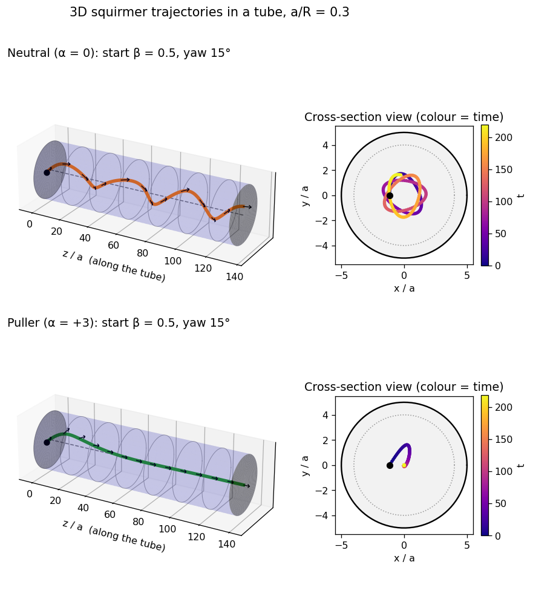
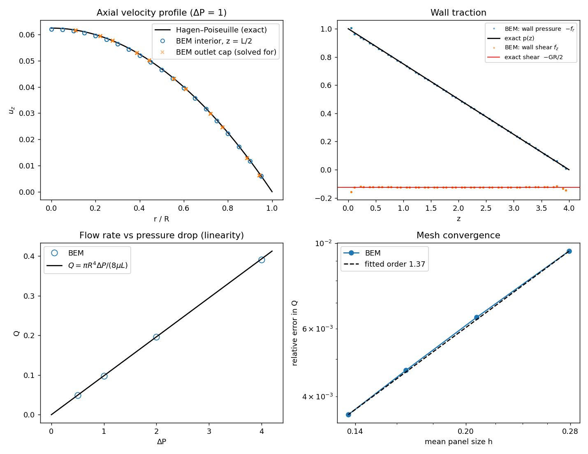
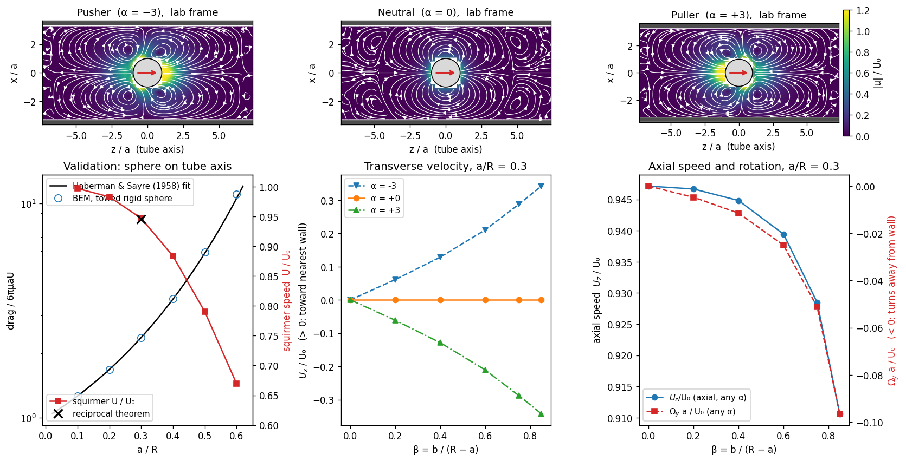
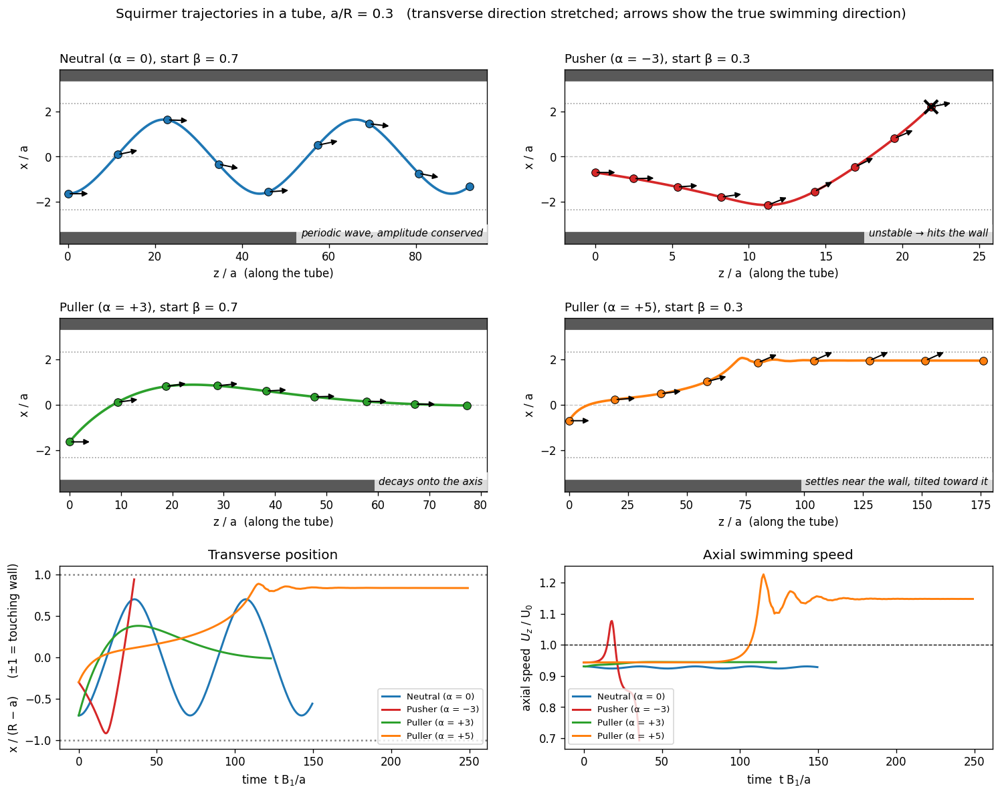

# squirmer-bem-3dtube
**$\color{red}{\Large \text{Boundary element simulations of a spherical squirmer (model microswimmer) inside a cylindrical tube.}}$**

This repository contains a working 3D boundary element method (BEM) for Stokes flow, written in C++17 with OpenBLAS. The code is built up and validated in three stages:

1. **Duct flow** — reproduce Hagen–Poiseuille flow in an empty cylindrical tube.
2. **Squirmer dynamics** — compute the swimming speed, rotation, and flow field of a spherical squirmer in free space and inside a tube.
3. **Trajectories** — integrate the swimmer's motion to study wavy, crashing, centring, wall-following, and 3D trajectories.

<p align="center">
  <br>
  <em>.</em>
</p>

The implementation is validated against analytical solutions and published results, including Blake (1971), Haberman & Sayre (1958), and Zhu, Lauga & Brandt (2013).

## Contents


<div align="center"> 
  
|1. [Running simulation](#1-running-simulation)| 2. [Repository structure](#2-repository-structure)| 3. [Input and output files](#3-input-and-output-files)|
|----|----|----|
| 4. [Mian results](#4-main-results)| 5. [Theory](#5-theory)| 6. [Numerical method](#6-numerical-method)|
| 7. [Limitations](#7-limitations)| 8. [References](#8-references)||

</div>


## 1. Running simulation

### Requirements

* A **C++17 compiler**: `g++ >= 9` or `clang >= 10`, `BLAS/LAPACK` ([OpenBLAS](https://www.openblas.net/) is recommended)
* **Python 3** for plots and the tutorial: `numpy`, `matplotlib`, `jupyter`


```bash
> sudo apt install libopenblas-dev # (On Ubuntu)

> brew install openblas #(On macOS)
```

### Build

Using CMake:

```bash
> cmake -S . -B build -DCMAKE_BUILD_TYPE=Release
> cmake --build build
```

Or using Make:

```bash
> make
```

On macOS with Homebrew OpenBLAS:

```bash
> cmake -S . -B build \
  -DCMAKE_PREFIX_PATH=$(brew --prefix openblas)

#OR

> make LIBS="-L$(brew --prefix openblas)/lib -lopenblas"
```

Install the Python dependencies with (optional):

```bash
pip install -r requirements.txt
```

### Run an example

```bash
> ./build/squirmer_bem inputs/duct_flow.in             #pressure flow without squirmer
> ./build/squirmer_bem inputs/squirmer_kinematics.in   #including squirmer
> ./build/squirmer_bem inputs/squirmer_field.in        #
> ./build/squirmer_bem inputs/trajectory_neutral.in    #
```


Input parameters can be override directly from the command line:

```bash
> ./build/squirmer_bem inputs/squirmer_kinematics.in a_over_R="0.2 0.4" beta=0 sphere_level=2
```

### Run the tests

```bash
> cd build
> ctest --output-on-failure
```

or:

```bash
> make test
```
A step-by-step tutorial is in [`notebooks/tutorial.ipynb`](notebooks/tutorial.ipynb).

---

## 2. Repository structure

```text
squirmer-bem-3dtube/
├── README.md
├── CMakeLists.txt
├── Makefile
├── requirements.txt
├── LICENSE
│
├── src/
│   ├── main.cpp
│   ├── duct_flow.hpp
│   ├── swimmer.hpp
│   ├── trajectory.hpp
│   └── utils/
│       ├── vec3.hpp
│       ├── linalg.hpp
│       ├── quadrature.hpp
│       ├── mesh.hpp
│       ├── kernels.hpp
│       ├── field.hpp
│       ├── config.hpp
│       └── io.hpp
│
├── inputs/
│
├── outputs/
│
├── tests/
│
├── notebooks/
│   └── tutorial.ipynb
│
└── docs/
```

The main physics is implemented in the header files, so other programs can reuse the solvers by including the relevant headers from `src/`.

---

## 3. Input and output files

Input files use simple:

```text
key = value
```

Lines beginning with `#` are comments. Values can also be overridden from the command line.


### Units

For squirmer simulations:

* Squirmer radius: `a = 1`
* Viscosity: `μ = 1`
* First squirming mode: `B1 = 1`
* Length: units of `a`
* Velocity: units of `B1`
* Time: units of `a/B1`
* Free-space swimming speed is: `U_0 = 2B1/3`

### $\color{red}{\text{mode = duct}}$

Simulates pressure-driven flow through an empty tube.

<div align="center"> 

| Parameter   |     Default | Description                            |
| ----------- | ----------: | -------------------------------------- |
| `R`         |           1 | Tube radius                            |
| `L`         |           4 | Tube length                            |
| `mu`        |           1 | Fluid viscosity                        |
| `n_theta`   |          24 | Panels around the tube                 |
| `n_z`       |          24 | Panels along the tube                  |
| `n_r`       |           6 | Rings on each cap                      |
| `dP_list`   | `0.5 1 2 4` | Pressure drops                         |
| `p_out`     |           0 | Outlet pressure                        |
| `dP_detail` |           1 | Pressure drop used for detailed output |
| `n_profile` |          20 | Points used for the velocity profile   |

</div>

### $\color{red}{\text{mode = kinematics}}$ 

Computes the squirmer's translation and rotation.

<div align="center"> 
  
| Parameter      | Default | Description                    |
| -------------- | ------: | ------------------------------ |
| `a_over_R`     |     0.3 | Confinement ratio `a/R`        |
| `beta`         |       0 | Radial offset                  |
| `n_theta`      |      24 | Tube resolution                |
| `sphere_level` |       3 | Icosphere refinement           |
| `L_over_R`     |       4 | Tube length                    |
| `towed_drag`   |       1 | Also compute towed-sphere drag |

</div>

The sphere contains: $
20 \times 4^\ell $ triangular panels, where `ℓ` is `sphere_level`.

For example:

* level 2 → 320 panels
* level 3 → 1280 panels

###  $\color{red}{\text{mode = field}}$

Computes the velocity field around the squirmer.

The main parameters are the same as `kinematics`, with:

<div align="center"> 
  
| Parameter  | Default | Description                        |
| ---------- | ------: | ---------------------------------- |
| `nx`       |      25 | Grid points across the tube        |
| `nz`       |      57 | Grid points along the tube         |
| `z_extent` |       7 | Axial extent                       |
| `x_extent` |       4 | Radial extent for free-space cases |

</div>

###  $\color{red}{\text{mode = trajectory}}$  

Integrates the swimmer's position and orientation in time.

<div align="center"> 
  
| Parameter      |      Default | Description                  |
| -------------- | -----------: | ---------------------------- |
| `name`         | `trajectory` | Output file prefix           |
| `alpha`        |            0 | `B2/B1`; pusher < 0 < puller |
| `a_over_R`     |          0.3 | Confinement                  |
| `beta0`        |          0.5 | Initial radial position      |
| `pitch0_deg`   |            0 | Initial pitch                |
| `yaw0_deg`     |            0 | Initial yaw                  |
| `dt`           |          0.5 | Time step                    |
| `t_max`        |          100 | Final time                   |
| `n_theta`      |           30 | Tube resolution              |
| `sphere_level` |            2 | Sphere resolution            |
| `L_over_R`     |            4 | Tube length                  |
| `beta_stop`    |         0.95 | Stop near the wall           |
| `budget_s`     |            0 | Time limit per call          |

</div>

If `budget_s` is non-zero, running the same command again resumes the calculation from the checkpoint. $\color{blue}{\text{All simulation results are written in CSV files with self-explanatory names.}}$

---


## 4. Main results

The implementation reproduces the expected analytical and published results with good accuracy.

### Duct flow
<p align="center">
  <br>
  <em>.</em>
</p>


### Squirmer behaviour

For `a/R = 0.3`:

* Confinement reduces the swimming speed.
* The `B2` mode produces no motion on the tube axis.
* Off-axis, the `B1` mode rotates the swimmer away from the nearest wall.
* Pullers tend to move away from the wall.
* Pushers tend to move toward the wall.

These trends agree with the results of Zhu, Lauga & Brandt (2013).
<p align="center">
  <br>
  <em>.</em>
</p>

### Example trajectories

<div align="center"> 
  
| Swimmer          | Initial position | Behaviour                            |
| ---------------- | ---------------- | ------------------------------------ |
| Neutral, `α = 0` | `β = 0.7`        | Periodic wavy trajectory             |
| Pusher, `α = -3` | `β = 0.3`        | Growing oscillation and wall contact |
| Puller, `α = 3`  | `β = 0.7`        | Overshoot followed by centring       |
| Puller, `α = 5`  | `β = 0.3`        | Settles near the wall                |

</div>

The 3D examples also produce helical and centring trajectories.

For `a/R = 0.3`, Zhu et al. report a critical value of approximately

$$
\alpha_c \approx 3.86,
$$

separating pullers that centre from pullers that settle near the wall.

<p align="center">
  <br>
  <em>.</em>
</p>

---

## 5. Theory

### 5.1 Stokes flow

A microswimmer of size $a \sim 10 \mu\text{m}$ moving at $U \sim 100 \mu\text{m/s}$ in water has Reynolds number $Re = \rho U a/\mu \sim 10^{-3}$. In this regime, inertia is negligible, and the flow obeys the Stokes equations:

$$-\nabla p + \mu\nabla^2\mathbf u = \mathbf 0, \qquad \nabla\cdot\mathbf u = 0, \qquad \boldsymbol\sigma = -p\,\mathbf I + \mu\left(\nabla\mathbf u + \nabla\mathbf u^{T}\right).$$

These equations are linear and have no time derivative: the flow responds instantly to the current boundary motion, and solutions can be superposed.

### 5.2 Fundamental solutions

  The flow due to a point force $\mathbf F$ at $\mathbf x_0$ is $u_i = \int \frac{1}{8\pi\mu}G_{ij} F_j$, where $G_{ij}$ isthe **Stokeslet** (Oseen tensor):

$$G_{ij}(\mathbf r) = \frac{\delta_{ij}}{r} + \frac{r_i r_j}{r^3}, \qquad \mathbf r = \mathbf x - \mathbf x_0 \quad r = |\mathbf r|.$$

The associated stress tensor defines the **stresslet** (force-dipole):

$$T_{ijk}(\mathbf r) = -6\ \frac{r_i r_j r_k}{r^5}.$$

### 5.3 Boundary integral representation

Let the fluid occupy a volume $V$ bounded by surfaces $S$. Take the normal $\mathbf m $ to point **out of the fluid**, and let $\mathbf f = \boldsymbol\sigma\cdot\mathbf m $ be the traction produced by fluid layer. Then, from the Lorentz reciprocal theorem, the velocity at any point $\mathbf x_0 $ inside the fluid is

$$u_j(\mathbf x_0) = \frac{1}{8\pi\mu}\int_S f_i(\mathbf x) G_{ij}(\mathbf x - \mathbf x_0) dS(\mathbf x) - \frac{1}{8\pi}\int_S u_i(\mathbf x)\,T_{ijk}(\mathbf x - \mathbf x_0) m_k(\mathbf x) dS(\mathbf x) \qquad \qquad (1)$$

The first integral is the **single-layer potential**, the second the **double-layer potential**. This equation is evaluated in the code `field.hpp` to obtain flow fields.

### 5.4 Boundary integral equation

As $\mathbf x_0$ approaches the boundary, the double layer jumps. Using the Gauss-type identity

$$\int_S T_{ijk}(\mathbf x - \mathbf x_0) m_k dS = -8\pi c(\mathbf x_0) \delta_{ij},$$

where $c = 1$ inside the fluid, $c = 1/2$ on a smooth part of $S$ and $c = 0$ outside, the jump can be subtracted out analytically. The result is the **completed** (singularity-subtracted) equation, which holds at every boundary point $\mathbf x_0$, including edges and corners:

$$0 = \frac{1}{8\pi\mu}\int_S f_i G_{ij} dS - \frac{1}{8\pi}\int_S \big[u_i(\mathbf x) - u_i(\mathbf x_0)\big] T_{ijk} m_k dS\qquad \qquad (2)$$

The subtraction makes the double-layer integrand weakly singular, and the solid-angle factor $c(\mathbf x_0)$ cancels exactly. The code evaluates the discrete identity numerically, so the cancellation is exact also at the discrete level. For an **unbounded** exterior fluid (a sphere with no tube), the surface at infinity contributes, and the left-hand side of above equation becomes $u_j(\mathbf x_0)$ instead of 0.

On every part of the boundary, at each point, either $\mathbf u$ or $\mathbf f$ (or a mix of components) is prescribed. 

### 5.5 Squirmer model

The squirmer (Lighthill 1952; Blake 1971) is a rigid sphere of radius $a$ with a prescribed tangential slip velocity on its surface. Keeping the first two modes of the surface slip velocity:

$$\mathbf u_s = \left(B_1\sin\theta + B_2\sin\theta\cos\theta\right)\mathbf e_\theta = \left(B_1 + B_2\cos\theta\right)\left[(\hat{\mathbf r}\cdot\mathbf e) \hat{\mathbf r} - \mathbf e\right],$$

with $\mathbf e$ the swimming direction and $\cos\theta = \hat{\mathbf r}\cdot\mathbf e$. The parameter $\alpha = B_2/B_1$ is the stresslet strength: pushers have $\alpha < 0$, pullers $\alpha > 0$, and neutral swimmers have $\alpha=0$.

The surface velocity is

$$\mathbf u(\mathbf x) = \mathbf U + \boldsymbol\Omega\times(\mathbf x - \mathbf x_c) + \mathbf u_s(\mathbf x), \qquad \mathbf x \in S_p,$$

with unknown translational and angular velocities $\mathbf U$ and $\boldsymbol\Omega$. They are fixed by the **force-free and torque-free** conditions, since there is no external force or torque:

$$\mathbf F = \int_{S_p} \boldsymbol\sigma\cdot\mathbf n dS = -\int_{S_p}\mathbf f dS = \mathbf 0, \qquad \mathbf L = -\int_{S_p}(\mathbf x - \mathbf x_c)\times\mathbf f dS = \mathbf 0.$$

(Here $\mathbf n = -\mathbf m$ is the normal pointing out of the particle.)

**Unbounded fluid.** The exact solution is $\mathbf U = \tfrac23 B_1\mathbf e$ and $\boldsymbol\Omega = \mathbf 0$. In spherical coordinates about the centre (lab frame), the flow field is

$$u_r = \frac{2}{3}B_1\frac{a^3}{r^3}\cos\theta + B_2\left(\frac{a^4}{r^4} - \frac{a^2}{r^2}\right)P_2(\cos\theta), \qquad u_\theta = \frac{1}{3}B_1\frac{a^3}{r^3}\sin\theta + B_2\frac{a^4}{r^4}\sin\theta\cos\theta,$$

where $P_2$ is the second Legendre polynomial

### 5.6 Boundary conditions of each problem

| problem | tube wall | tube ends | sphere |
|---|---|---|---|
| Stage 1 duct flow | $\mathbf u = 0$ | $u_x = u_y = 0$, $f_z = +p_\text{in}$ (inlet, $\mathbf m = -\mathbf e_z$), $f_z = -p_\text{out}$ (outlet) | — |
| Stage 2 swimmer in tube | $\mathbf u = 0$ | closed: $\mathbf u = 0$ | $\mathbf U + \boldsymbol\Omega\times\mathbf r + \mathbf u_s$, force/torque-free |
| Towed sphere (validation) | $\mathbf u = 0$ | $\mathbf u = 0$ | $\mathbf U$ prescribed, $\mathbf u_s = 0$ |

**Duct flow.** The exact Hagen–Poiseuille solution is $u_z = G(R^2 - r^2)/4\mu$, with $G = (p_\text{in} - p_\text{out})/L$ and $Q = \pi R^4 G/8\mu$. The wall traction is $f_r = -p(z)$ and $f_z = -GR/2$.

**Closed tube.** Following Zhu, Lauga & Brandt (2013), the swimmer tube is closed at $z = \pm L/2$. This models an infinitely long tube filled with fluid at rest, with zero net flux. A force-free disturbance decays exponentially along a tube over a length of order $R$, so $L = 4R$ is enough. 

**Towed sphere on the axis.** Haberman & Sayre (1958) give the drag correction $K = F/(6\pi\mu a U)$ for a tube with fluid at rest far away, as a polynomial fit:

$$K(\lambda) = \frac{1 - 0.75857 \lambda^5}{1 - 2.1050 \lambda + 2.0865 \lambda^3 - 1.7068 \lambda^5 + 0.7260 \lambda^6}, \qquad \lambda = a/R.$$

### 5.7 Reciprocal-theorem check

For a squirmer and a towed rigid sphere in the same geometry (towing velocity $\hat{\mathbf U}$, traction on the body $\hat{\mathbf t}$, drag $\hat{\mathbf F}$), the Lorentz reciprocal theorem gives

$$\mathbf U\cdot\hat{\mathbf F} = -\int_{S_p}\mathbf u_s\cdot\hat{\mathbf t} dS .$$

This yields the swimming speed without imposing the force-free condition, which makes it an independent check of the swimmer solution.

### 5.8 Equations of motion

The squirmers motion is described by the time evolution of its position and orientation:

$$\frac{d\mathbf X}{dt} = \mathbf U(\mathbf X,\mathbf e), \qquad \frac{d\mathbf e}{dt} = \boldsymbol\Omega(\mathbf X,\mathbf e)\times\mathbf e .$$

By the tube's symmetry, $\mathbf U$ and $\boldsymbol\Omega$ depend only on the swimmer's position in the cross-section and on its orientation, not on its axial position $z$.

---

## 6. Numerical method

### 6.1 Discretisation

Surfaces are meshed with $P$ flat triangles. Velocity and traction are taken constant on each panel. Boundary integral equation (Eq. 2) is enforced at every panel centroid (**collocation**), giving $3P$ equations:

$$\mathbf A_f \mathbf f + \mathbf A_u \mathbf u = \mathbf 0, \qquad
(A_f)_{3i+a, 3p+b} = \frac{1}{8\pi\mu}\int_{p} G_{ab}(\mathbf x - \mathbf x_i) dS,$$

$$(A_u)_{3i+a, 3p+b} = -\frac{1}{8\pi}\int_{p} T_{abk} m_k dS  +  \delta_{ip} \frac{1}{8\pi}\sum_{q}\int_{q} T_{abk} m_k dS .$$

The last term is the discrete version of the subtraction in Eq. 2. For each scalar unknown, the column comes from $\mathbf A_f$ (traction unknown) or from $\mathbf A_u$ (velocity unknown). The known values move to the right-hand side.

**Meshes.**

* *Tube:* $n_\theta$ panels around the circumference. For swimmer problems, the axial spacing is graded: fine within $|z| < a + R/2$, growing by a factor 1.25 toward the ends. The polygon vertices are placed at radius $R\sqrt{\gamma/\sin\gamma}$, $\gamma = 2\pi/n_\theta$, so that the faceted cross-section has the exact **area** $\pi R^2$. This removes the leading $O(h^2)$ geometric error.
* *Sphere:* a subdivided icosahedron ($20\cdot4^\ell$ panels), scaled to enclose the exact **volume** $\tfrac43\pi a^3$. 

### 6.2 Quadrature

| situation | rule |
|---|---|
| distance $d =Abs( \mathbf x_c^{(p)} - \mathbf x_0) /h_p \ge 3$ | 7-point Dunavant (degree 5) |
| $1.5 \le d < 3$ / $0.75 \le d < 1.5$ / $d < 0.75$ | the same rule on 4 / 16 / 64 sub-triangles |
| $\mathbf x_0$ inside the panel (self term) | single layer: Duffy transformation on the 3 sub-triangles around $\mathbf x_0$ ($10\times10$ Gauss–Legendre), which removes the $1/r$ singularity. Double layer: exactly zero on a flat panel, since $\mathbf r\cdot\mathbf m = 0$ |

Here $h_p = \sqrt{2A_p}$ is the panel size. The same adaptive rules are used when evaluating the flow field (Eq. 1). Accuracy nevertheless degrades for points closer to a surface than about one panel size (see §8).

### 6.3 Null modes and deflation

On a closed surface where the velocity is prescribed everywhere, a uniform normal traction $\mathbf f = c \mathbf m$ generates no flow: $\int_S G_{ij} m_i dS = 0$ by incompressibility. The single-layer operator is therefore singular, with one null mode per closed Dirichlet surface (the closed tube, and the sphere). These modes carry no velocity, force, torque or power ($\mathbf u_s\cdot\mathbf m = 0$), so they can be removed by **Wielandt deflation**, adding to each such block

$$\frac{1}{8\pi\mu\sqrt{A_S}} \mathbf m(\mathbf x_i)b\mathbf m(\mathbf x_p)^{T}A_p ,$$

which makes the matrix invertible without changing any physical result. The duct-flow problem has none: its end caps have prescribed traction, which fixes the pressure level.

### 6.4 Rigid-body closure

The swimmer's surface velocity is written as $\mathbf u = \mathbf K [\mathbf U, \boldsymbol\Omega] + \mathbf u_s$, with $\mathbf K_p = [\mathbf I | -[\mathbf r_p]_\times]$. The force and torque conditions add six rows. The unknowns are all tractions plus $(\mathbf U, \boldsymbol\Omega)$.

### 6.5 Schur complement: factorise the tube once

With unknowns split into tube ($t$) and sphere ($s$), the system reads

$$\begin{pmatrix} \mathbf T & \mathbf B & \mathbf C_t \\ \mathbf D & \mathbf E & \mathbf C_s \\ \mathbf 0 & \mathbf F_c & \mathbf 0\end{pmatrix}
\begin{pmatrix}\mathbf f_t\\ \mathbf f_s\\ \mathbf U,\boldsymbol\Omega\end{pmatrix} = \begin{pmatrix}\mathbf r_t\\ \mathbf r_s\\ \mathbf 0\end{pmatrix}.$$

The tube–tube block $\mathbf T$ depends only on the tube, so it is LU-factorised **once** (class `Tube`). Each swimmer position then only requires the couplings $\mathbf B, \mathbf C_t, \mathbf D, \mathbf E, \mathbf C_s$ and the reduced system

$$\left[\mathbf E - \mathbf D\mathbf T^{-1}\mathbf B \;\middle|\; \mathbf C_s - \mathbf D\mathbf T^{-1}\mathbf C_t\right]\begin{pmatrix}\mathbf f_s\\ \mathbf U,\boldsymbol\Omega\end{pmatrix} = \mathbf r_s - \mathbf D\mathbf T^{-1}\mathbf r_t ,$$

of size $3P_s + 6$ (plus the constraint rows). The tube tractions are recovered as $\mathbf f_t = \mathbf T^{-1}(\mathbf r_t - \mathbf B\mathbf f_s - \mathbf C_t[\mathbf U;\boldsymbol\Omega])$ when the flow field is needed.

For **trajectories**, the tube moves axially with the swimmer, so the swimmer always sits near $z = 0$ in the computational frame. The tube is never re-meshed, and $\mathbf T$ is factorised once per run.

### 6.6 Time integration

Fourth-order Adams–Bashforth (as in Zhu, Lauga & Brandt 2013), started with three classical RK4 steps:

$$\mathbf y_{n+1} = \mathbf y_n + \frac{\Delta t}{24}\left(55 \mathbf F_n - 59 \mathbf F_{n-1} + 37 \mathbf F_{n-2} - 9 \mathbf F_{n-3}\right),$$

with $\mathbf y = (\mathbf X, \mathbf e)$ and one BEM solve per step. The orientation is renormalised after each step. Both squirming modes are solved as two right-hand sides of the same system, and combined with $\alpha$.

---

## 7. Limitations

The current implementation has several limitations:

* **Dense matrices:** computational cost grows quickly with mesh size.
* **Flat triangular panels:** higher-order curved elements could improve accuracy.
* **Near-wall motion:** accuracy decreases when the swimmer-wall gap becomes smaller than roughly one wall panel.
* **Newtonian fluid:** non-Newtonian effects are not included.
* **Rigid walls:** deformable boundaries are not currently supported.
* **No fluid inertia:** the method is restricted to Stokes flow.

Near-wall simulations may require: local wall refinement, smaller time steps, lubrication corrections.

---

## 8. References

* Blake, J. R. (1971). A spherical envelope approach to ciliary propulsion. *J. Fluid Mech.* 46, 199–208.
* Haberman, W. L. & Sayre, R. M. (1958). Motion of rigid and fluid spheres in stationary and moving liquids inside cylindrical tubes. *David Taylor Model Basin Report* 1143.
* Higdon, J. J. L. & Muldowney, G. P. (1995). Resistance functions for spherical particles, droplets and bubbles in cylindrical tubes. *J. Fluid Mech.* 298, 193–210.
* Ishikawa, T., Simmonds, M. P. & Pedley, T. J. (2006). Hydrodynamic interaction of two swimming model micro-organisms. *J. Fluid Mech.* 568, 119–160.
* Lighthill, M. J. (1952). On the squirming motion of nearly spherical deformable bodies through liquids at very small Reynolds numbers. *Comm. Pure Appl. Math.* 5, 109–118.
* Pozrikidis, C. (1992). *Boundary Integral and Singularity Methods for Linearized Viscous Flow.* Cambridge University Press.
* Zhu, L., Lauga, E. & Brandt, L. (2013). Low-Reynolds-number swimming in a capillary tube. *J. Fluid Mech.* 726, 285–311.

---


